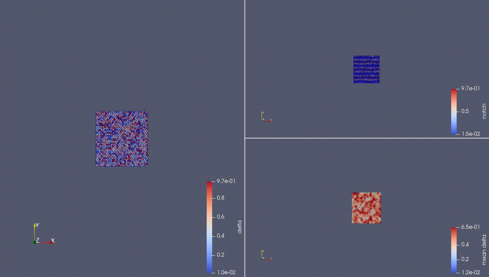

# A Chaste based user repository for simulating cellular delta notch signaling based on the vertex model

- general information about Chaste cell-based branch can be found [here](https://www.cs.ox.ac.uk/chaste/cell_based_index.html)

- **src** folder includes the codes for simulating **Equations 4-12** given in this [paper](http://science.sciencemag.org/content/356/6337/eaai7407/tab-pdf)

- [Chaste repository](https://github.com/Chaste/Chaste)

- Some visualzations shown in Paraview and converted into GIF

